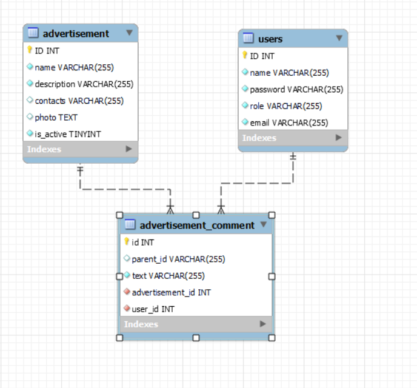

# Доска объявлений | BillboardApplication
____

# Навигация
- [Описание](#Описание)
- [Доступные API для вызова](#Api-для-вызова)
- [База данных](#База-данных)
- [Как запустить локально](#Как-запустить-локально)
- [Покрытие тестами](#Покрытие-тестами)
- [Контактные данные](#Контактные-данные)

____
## Описание:

Данный проект представляет собой тестовое задание от Red_mad_Robot для прохождения конкурса в bootCamp. Проект представляет собой доску с объявлениями, на которую пользователи могут размещать свое. Можно под объявлением оставить комментарий и тем самым пообщаться с автором объявления. Также объявление можно "Принять" (поменяется его статус).
Само тз можно посмотреть в документе, который находится по [ссылке вот тут (кликабельно)](https://docs.google.com/document/d/1jrUujmZOArdqPUjFGB7ML9mQ9a7qvJ7K/edit?usp=sharing&ouid=117991556454832908255&rtpof=true&sd=true)

В данном проекте реализован не весь функционал и реализована только back-end часть. Чтобы проьестировать методы, можно воспользоваться приложением Postman. Пордробнее о том, как запустить и какие есть адреса - в следующем пункте.

____

## Api для вызова:

Ниже будет список методов с их полным адресом, также я предоставлю json - спецарий для тестирования через Postman.

Ссылка на json для Postman [тут](./data/BilboardApp.postman_collection.json)

- ApiAuth:
  - GET: /api/auth/check - проверить текущего авторизированного пользователя;
  - GET: /api/auth/login (email, password) - зайти в системе;
  - GET: /api/auth/logout - разлогиниться;
- ApiUser:
  - POST: /api/register (name, email, password, role) -  зарегистрироваться;
  - POST: /api/comment (parentId, text, advertisementId) - оставить комментарий под объявлением;
- ApiAdvertisement:
  - GET: /api/advertisement - получить список всех доступных объявлений;
  - PUT: /api/advertisement - (id) - совершить сделку с указанным объявлением;
  - POST: /api/advertisement (name, description, MultipartFile photo) - создать новое объявление;

Почти все методы, за исключением получения текущего списка, проверки текущего пользователя требуют авторизации. 

____

## База данных:

В данном проекте использовалась реляционная база данных mysql. 

Ниже представлена EER диаграмма связей и таблицы:

Дамп базы данных можно найти в папке data в данном проекте.

[Путь к папке](./data/BillboardApplication.sql)

____

## Как запустить локально:

Для того, чтобы запустить проект локально вам необходимы JDK 16, система контроля версий git, сборщик проектов maven.
Клонировать проект можно через git bash:

    git clone https://github.com/VlasovM/BillboardApplication.git
    
Далее вам нужно изменить такие параметры, как пароль и логин к подключению базы данных. Эти переменные лежат в файле application.properties.

Изменить эти параметры можно тремя способами: 
- Просто менять ссылку переменной окружения на своё значение;
- При запуске jar файла запустить его с параметрами;

Для первого варианта вам нужно настроить следующие переменные окружения: 

- DB_USERNAME
- DB_PASSWORD

Далее независимо какой способ изменения вы выбрали, следует выполнить команду:
 
    mvn clean install
    
Если вы поменяли переменные окружения самостоятельно, то запустить проект можно следующим образом:

    java -jar jarBillboardApplication-0.0.1-SNAPSHOT.jar
    
Если вы не меняли переменные окружения, то нужно задать их при запуске проекта:

    java -jar javlasovblog-0.0.1-SNAPSHOT.jar --spring.datasource.username=<usernameDB> --spring.datasource.password=<passwordDB>
    
 Где:
  - usernameDB - логин локальной базы данных;
  - passwordDB - пароль локальной базы данных;
    
При запуске заменить usernameDB, passwordDB на ваши собственные значения.

____

## Покрытие тестами:

Покрыт сервисный слой (папка service). Процент покрытия был проверен встроенным инструментом IntelijIDEA - Coverage.

Результаты:
  
  | Service | Class, % | Method, %  | Line, %  |
| ------------- |:-------------:|:-----:|:------:|
| AdvertisementService  | 100%  | 100% | 95% (42\44) |
| CommentService | 100% | 100% | 100% |
| LoginService | 100% | 100% | 100% |
| UserService | 100% | 100% | 100% |
| Total | 100% | 100% | 97% |

____

## Контактные данные:

По всем интересующим вас вопросам можно писать на почту:

m.a.vlasov97@gmail.com

Или связаться со мной в телеграм:

https://t.me/JaVlasov
